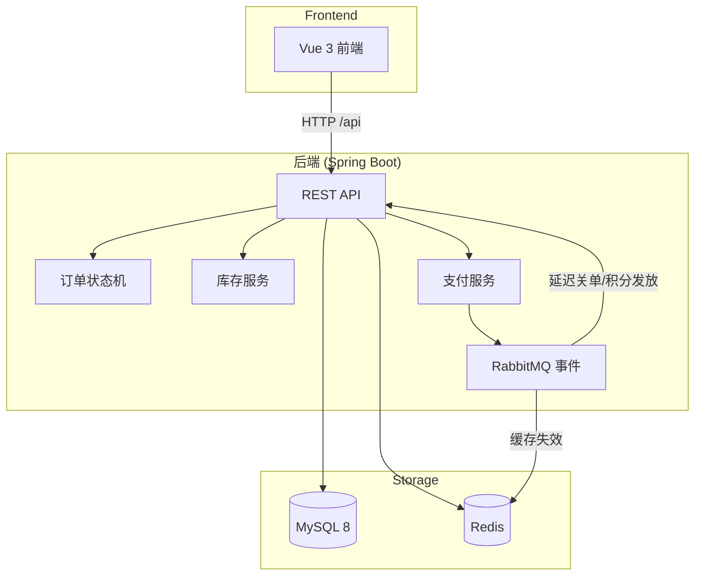

# EasyMall

> 基于 Spring Boot + Redis + RabbitMQ 的 B2C 电商系统，实现了完整的交易链路设计。

## 核心亮点

- **订单状态机** — 8 种状态、基于 `EnumMap` 的状态转换表，所有流转通过 `OrderStateMachine` 统一校验
- **库存三态分离** — `available_stock / locked_stock / sold_stock` 独立管理，乐观锁防止超卖
- **支付幂等** — `WAITING_PAY → PAYING → PAID` 三态 CAS 状态机 + 回调日志，防止重复扣款
- **MQ 延迟关单** — RabbitMQ TTL + DLX 实现超时自动取消，CAS 防止与支付并发竞争
- **优惠券生命周期** — 下单锁定 → 支付确认 → 取消/超时返还，完整的状态流转管理
- **积分幂等** — `biz_type + biz_id` 唯一约束，订单、签到、评价等场景防重复发放
- **领域事件驱动** — `DomainEvent` 统一事件模型，事务提交后异步投递，消费端幂等 + DLQ 兜底
- **前后端分离** — Vue 3 + Naive UI 前端，Spring Boot RESTful 后端，Docker Compose 独立部署

## 技术栈

### 后端

| 组件 | 版本 | 用途 |
|------|------|------|
| JDK | 17 | 运行时 |
| Spring Boot | 4.0.1 | 基础框架 |
| MySQL | 8.0 | 关系型数据库 |
| Redis | 7 | 缓存（搜索结果、热门商品、登录态） |
| RabbitMQ | 3 | 异步事件驱动（延迟关单、积分发放、缓存清理） |
| MyBatis Plus | — | ORM 框架 |
| Spring Security + JWT | — | 认证授权 |
| Flyway | — | 数据库版本迁移 |

### 前端

| 组件 | 用途 |
|------|------|
| Vue 3 | 前端框架 |
| Vite | 构建工具 |
| TypeScript | 类型安全 |
| Naive UI | 组件库 |
| Pinia | 状态管理 |
| Axios | HTTP 客户端 |

### 工程化

| 组件 | 用途 |
|------|------|
| Docker Compose | 容器化部署 |
| GitHub Actions | CI 流水线 |
| Flyway | 数据库迁移 |
| Maven | 构建管理 |

## 系统架构



## 核心流程设计

### 订单交易链路

```
用户下单 → 锁定库存 → 创建支付单 → 发布延迟关单消息
                                    ↓
                          用户支付 ← → 超时自动取消
                              ↓              ↓
                    确认库存/使用优惠券    释放库存/返还优惠券
                              ↓
                    确认收货 → MQ 异步发放积分
```

### 库存锁定模型

库存表 `inventory` 采用三态分离设计：

| 字段 | 含义 |
|------|------|
| `available_stock` | 可售库存，用户可见的可购买数量 |
| `locked_stock` | 锁定库存，下单后从可售转移至此 |
| `sold_stock` | 已售库存，支付成功后从锁定转移至此 |

- **下单**：`available -= N, locked += N`（乐观锁，防止超卖）
- **支付**：`locked -= N, sold += N`
- **取消**：`locked -= N, available += N`

### 支付幂等机制

支付单 `payment_order` 采用 CAS 状态机防止重复扣款：

1. 创建支付单，状态 `WAITING_PAY`
2. 支付时 CAS 更新为 `PAYING`，并发请求被拒绝
3. 回调处理时 CAS 更新为 `PAID`，重复回调直接返回成功
4. 每次回调都记录 `payment_callback_log`，可追溯

## 项目结构

```
EasyMall/
├── easymall-backend/              # Spring Boot 后端
│   ├── src/main/java/org/ruikun/
│   │   ├── common/                # Result、ResponseCode、分页封装
│   │   ├── enums/                 # 共享枚举（OrderStatus、PaymentStatus 等）
│   │   ├── exception/             # BusinessException、GlobalExceptionHandler
│   │   ├── infrastructure/
│   │   │   ├── config/            # MyBatisPlus、文件上传配置
│   │   │   ├── mq/                # RabbitMQ 配置、领域事件、消费者
│   │   │   └── security/          # Spring Security + JWT
│   │   └── modules/               # 业务模块（按功能域组织）
│   │       ├── order/             # 订单、购物车、订单状态机
│   │       ├── payment/           # 支付单、支付回调日志
│   │       ├── inventory/         # 库存、库存流水
│   │       ├── product/           # 商品、分类
│   │       ├── user/              # 用户、会员等级、签到、会员折扣
│   │       ├── coupon/            # 优惠券模板、用户优惠券、使用记录
│   │       ├── points/            # 积分记录、积分商品、积分兑换
│   │       ├── comment/           # 商品评论
│   │       ├── favorite/          # 商品收藏
│   │       ├── upload/            # 文件上传
│   │       └── admin/             # 后台管理（跨模块）
│   ├── src/main/resources/
│   │   ├── application.yml        # 基础配置
│   │   ├── application-dev.yml    # 开发环境
│   │   ├── application-prod.yml   # 生产环境（纯环境变量）
│   │   ├── db/migration/          # Flyway 迁移脚本（V1-V12）
│   │   └── mapper/                # MyBatis XML
│   ├── Dockerfile                 # 后端容器化
│   └── docker-compose.yml         # MySQL + Redis + RabbitMQ + 后端
├── easymall-frontend/             # Vue 3 前端
│   ├── src/
│   │   ├── views/                 # 页面（管理端 + 用户端）
│   │   ├── api/                   # API 请求封装
│   │   ├── stores/                # Pinia 状态管理
│   │   ├── router/                # 路由配置
│   │   └── components/            # 公共组件
│   ├── Dockerfile                 # 前端多阶段构建（Node → Nginx）
│   ├── nginx.conf.template        # Nginx 配置模板（SPA + API 反向代理 + 静态文件）
│   └── docker-compose.yml         # 前端独立部署
├── docs/                          # 项目文档
├── openspec/                      # OpenSpec 变更管理
├── .env.example                   # 环境变量示例
├── CLAUDE.md
└── README.md
```

## 快速开始

### 环境要求

- JDK 17
- MySQL 8.0+
- Redis 6.0+
- RabbitMQ 3+
- Maven 3.6+
- Node.js 20+

### 本地启动

**1. 配置环境变量**

```bash
# 在仓库根目录下
cp .env.example easymall-backend/.env
```

本地 `mvn spring-boot:run` 使用 dev profile（`application-dev.yml`），MySQL 密码硬编码为 `123456`。`.env` 中的 `MYSQL_PASSWORD` 仅供 Docker Compose 使用，不会覆盖 dev profile 的数据库连接。如果本地 MySQL 密码不是 `123456`，需要修改 `application-dev.yml` 或通过启动参数 `--spring.datasource.password=xxx` 覆盖。

> Docker 启动基础设施时需要 `.env` 中的密码变量，所以**先配置再启动**。

**2. 启动基础设施**

```bash
cd easymall-backend
docker compose up -d mysql redis rabbitmq
```

或手动启动 MySQL 8.0、Redis 7、RabbitMQ 3 服务。

**3. 初始化数据库**

dev profile 默认关闭 Flyway（`spring.flyway.enabled: false`），需要手动初始化：

```bash
mysql -u root -p123456 easymall < src/main/resources/db/migration/V1__Create_initial_tables.sql
mysql -u root -p123456 easymall < src/main/resources/db/migration/V2__Create_member_tables.sql
mysql -u root -p123456 easymall < src/main/resources/db/migration/V3__Create_points_exchange_tables.sql
mysql -u root -p123456 easymall < src/main/resources/db/migration/V5__Add_coupon_tables.sql
mysql -u root -p123456 easymall < src/main/resources/db/migration/V6__Create_inventory_tables.sql
mysql -u root -p123456 easymall < src/main/resources/db/migration/V7__Create_payment_tables.sql
mysql -u root -p123456 easymall < src/main/resources/db/migration/V8__Create_message_consume_log.sql
mysql -u root -p123456 easymall < src/main/resources/db/migration/V9__Add_points_record_unique_constraint.sql
mysql -u root -p123456 easymall < src/main/resources/db/migration/V10__Add_coupon_lifecycle_indexes.sql
mysql -u root -p123456 easymall < src/main/resources/db/migration/V11__Add_points_biz_columns.sql
mysql -u root -p123456 easymall < src/main/resources/db/migration/V12__Add_favorite_redundant_columns.sql
mysql -u root -p123456 easymall < src/main/resources/db/migration/test-data.sql
```

> Docker 全栈部署（prod profile）会自动执行 Flyway 迁移，无需手动导入。

**4. 启动后端**

```bash
cd easymall-backend
mvn spring-boot:run
```

**5. 启动前端**

```bash
cd easymall-frontend
npm install
npm run dev
```

**6. 访问系统**

- 前端：http://localhost:5173
- 后端 API：http://localhost:8080/api
- RabbitMQ 管理面板：http://localhost:15672（guest/guest）

### Docker Compose 一键启动

```bash
# 在项目根目录下
cp .env.example .env
# 编辑 .env 填入 MYSQL_PASSWORD、JWT_SECRET、PAYMENT_MOCK_SIGNATURE

# 一键启动全部 5 个服务（MySQL + Redis + RabbitMQ + 后端 + 前端）
docker compose up -d
```

也可分别在 `easymall-backend/` 和 `easymall-frontend/` 下独立启动，适用于开发调试。详见 [部署指南](docs/deployment.md)

## 文档

| 文档 | 说明 |
|------|------|
| [系统架构](docs/architecture.md) | 架构概览、后端模块化、前端架构、部署架构 |
| [业务设计](docs/business/order-state-machine.md) | 订单状态机、库存模型、支付系统、MQ 事件驱动、优惠券生命周期、积分流水 |
| [数据库设计](docs/database.md) | ER 图、核心表说明、Flyway 迁移策略 |
| [前端开发指南](docs/frontend-guide.md) | 安装启动、技术栈、生产构建 |
| [部署指南](docs/deployment.md) | 本地开发、Docker Compose、云服务器部署 |
| [演示指南](docs/demo.md) | 默认账号、管理端/用户端演示路径、交易链路亮点 |
| [API 文档](docs/API.md) | 完整的 REST API 接口文档 |
| [图片上传指南](docs/image-upload-guide.md) | 文件上传功能使用说明 |

## 许可证

MIT License
