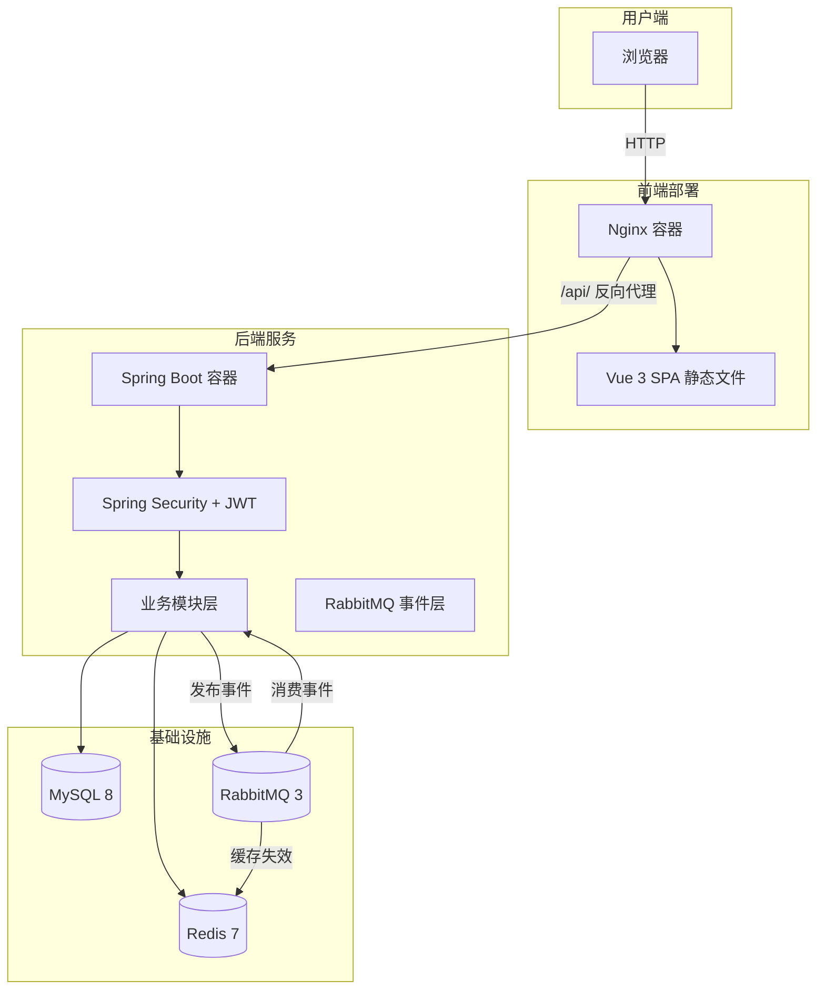
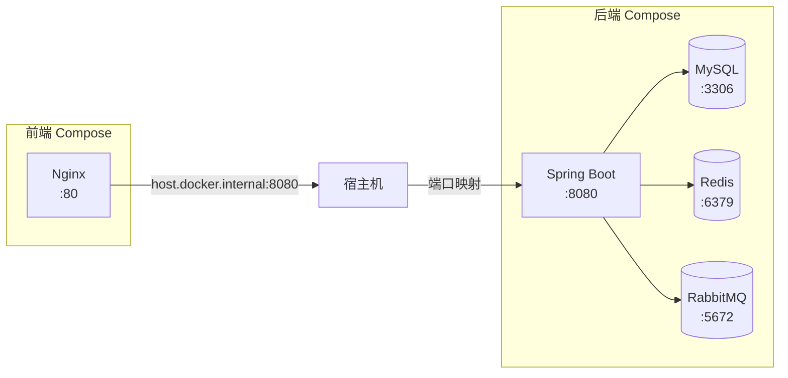

# 系统架构

## 系统架构总览



## 后端模块化架构

后端采用基于业务域的模块化包结构，每个模块包含独立的 controller、dto、entity、mapper、service、vo 子包。

### 业务模块

| 模块 | 包路径 | 职责 |
|------|--------|------|
| 订单 | `modules/order/` | 订单创建、状态流转、购物车、订单状态机 |
| 支付 | `modules/payment/` | 支付单创建、支付处理、回调日志 |
| 库存 | `modules/inventory/` | 库存锁定/释放/确认、库存流水 |
| 商品 | `modules/product/` | 商品管理、分类管理、全文搜索 |
| 用户 | `modules/user/` | 用户注册登录、会员等级、签到、会员折扣 |
| 优惠券 | `modules/coupon/` | 优惠券模板、用户优惠券、使用记录、定时过期 |
| 积分 | `modules/points/` | 积分记录、积分商品、积分兑换 |
| 评论 | `modules/comment/` | 商品评论、商家回复 |
| 收藏 | `modules/favorite/` | 商品收藏 |
| 上传 | `modules/upload/` | 文件上传与存储 |
| 后台管理 | `modules/admin/` | 管理员控制器（跨模块聚合） |

### 公共层

| 包路径 | 职责 |
|--------|------|
| `common/` | `Result<T>` 统一响应封装、`ResponseCode` 状态码、`PageRequest/PageResult` 分页、`ErrorDetail` 错误详情 |
| `enums/` | 共享枚举：`OrderStatus`、`PaymentStatus`、`CouponStatus`、`CouponType`、`PointsBizType`、`UserRole` 等 |
| `exception/` | `BusinessException` 业务异常、`GlobalExceptionHandler` 全局异常处理 |

### 基础设施层

| 包路径 | 职责 |
|--------|------|
| `infrastructure/config/` | MyBatisPlus 配置、文件上传配置 |
| `infrastructure/security/` | Spring Security 配置、JWT 过滤器、JWT 工具类 |
| `infrastructure/mq/` | RabbitMQ 配置、领域事件模型、事件发布器、消费者 |

## 前端架构

前端使用 Vue 3 + TypeScript + Naive UI，采用单应用双区域结构（管理端 + 用户端）。

### 技术栈

- **Vue 3** — Composition API
- **Vite** — 构建工具，内置 `/api` 代理转发
- **TypeScript** — 类型安全
- **Naive UI** — 组件库
- **Pinia** — 状态管理
- **Axios** — HTTP 客户端

### 目录结构

```
easymall-frontend/
├── src/
│   ├── api/                # API 请求封装
│   ├── assets/             # 静态资源
│   ├── components/         # 公共组件
│   ├── layouts/            # 布局组件
│   ├── router/             # 路由配置
│   ├── stores/             # Pinia 状态管理
│   ├── types/              # TypeScript 类型定义
│   ├── utils/              # 工具函数
│   └── views/              # 页面
│       ├── category/       # 分类管理（管理端）
│       ├── comment/        # 评论管理（管理端）
│       ├── coupon/         # 优惠券管理（管理端）
│       ├── memberLevel/    # 会员等级管理（管理端）
│       ├── pointsProduct/  # 积分商品管理（管理端）
│       ├── product/        # 商品管理（管理端）
│       ├── user-home/      # 首页（用户端）
│       ├── user-cart/      # 购物车（用户端）
│       ├── user-checkout/  # 结算（用户端）
│       ├── user-orders/    # 我的订单（用户端）
│       ├── user-payment/   # 支付（用户端）
│       ├── user-coupons/   # 我的优惠券（用户端）
│       ├── user-member/    # 会员中心（用户端）
│       ├── user-favorites/ # 收藏（用户端）
│       ├── user-comments/  # 评论（用户端）
│       └── user-login/     # 登录注册（用户端）
├── Dockerfile              # 多阶段构建（Node → Nginx）
├── nginx.conf              # SPA 路由 + API 反向代理
└── docker-compose.yml      # 独立部署配置
```

## 部署架构

系统采用前后端独立 Docker 部署，通过 `host.docker.internal` 通信，无需手动创建共享网络。



### 网络通信方式

- **后端 Compose**：使用 Docker Compose 默认网络，服务间通过服务名互访（如 `mysql:3306`、`redis:6379`）
- **前端 Compose**：通过 `host.docker.internal` + `extra_hosts` 访问宿主机上后端映射的 8080 端口
- **无需任何手动网络配置**，直接 `docker compose up -d` 即可

### 反向代理

前端 Nginx 配置：
- `/` → SPA 静态文件（`try_files $uri /index.html`）
- `/api/` → `proxy_pass http://host.docker.internal:8080/api/`
