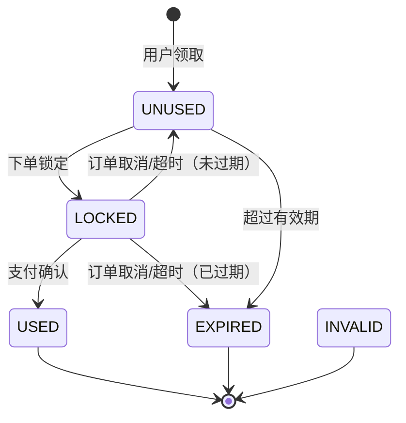

# 优惠券生命周期

## 优惠券状态定义

用户优惠券 `user_coupon` 的状态流转：

| 状态码 | 枚举值 | 中文名 | 说明 |
|--------|--------|--------|------|
| 0 | `UNUSED` | 未使用 | 用户已领取，等待使用 |
| 1 | `USED` | 已使用 | 订单支付成功后确认 |
| 2 | `EXPIRED` | 已过期 | 超过有效期 |
| 3 | `LOCKED` | 已锁定 | 下单时锁定，绑定订单 |
| 4 | `RETURNED` | 已返还 | 枚举保留值，当前返还逻辑实际回到 `UNUSED` 或 `EXPIRED` |
| 5 | `INVALID` | 已失效 | 模板下架或其他原因失效 |

## 状态流转

## 核心操作

### 1. 领取优惠券

- 用户从优惠券中心主动领取
- 积分兑换优惠券
- 系统自动发放（新人注册、会员升级）
- 校验库存（`received_count < total_count`）、会员等级限制、有效期

### 2. 下单锁定

下单时如果用户选择了优惠券：

1. 校验优惠券状态为 `UNUSED`
2. 校验优惠券仍在有效期内
3. 校验订单金额满足使用门槛（`min_amount`）
4. 将优惠券状态更新为 `LOCKED`
5. 绑定 `order_id` 和 `order_no`
6. 计算优惠金额，从订单支付金额中扣除

### 3. 支付确认

支付回调成功后：

1. 将优惠券状态从 `LOCKED` 更新为 `USED`
2. 记录使用时间
3. 记录使用日志（`coupon_usage_log`，action=1）

### 4. 取消/超时返还

订单取消或超时自动取消时，`returnLockedCoupon()` 检查优惠券是否已过期：

- **未过期**：状态从 `LOCKED` 恢复为 `UNUSED`，用户可继续使用
- **已过期**：状态更新为 `EXPIRED`

同时清除 `order_id` 和 `order_no`，并记录返还日志（`coupon_usage_log`，action=2）。

## 优惠券类型

| 类型 | 说明 | 优惠计算 |
|------|------|---------|
| 固定金额券 | 满 X 减 Y | `payAmount - discountAmount` |
| 百分比折扣券 | X 折扣 | `payAmount × discountPercentage%`，不超过 `maxDiscount` |
| 新人专享券 | 注册自动发放 | 同固定金额券 |
| 会员专属券 | 会员升级自动发放 | 同固定金额券 |

## 优惠券使用规则

- 每笔订单限用一张优惠券
- 优惠券在会员折扣后的金额基础上计算
- 使用门槛校验：订单金额 ≥ `min_amount`
- 百分比券有最大优惠金额限制（`max_discount`）
- 部分优惠券有会员等级限制（`member_level`）

## 定时过期

`CouponScheduledTask` 定时扫描过期的用户优惠券，将状态从 `UNUSED` 更新为 `EXPIRED`。

## 使用记录

`coupon_usage_log` 记录所有使用和返还操作：

| 字段 | 说明 |
|------|------|
| `user_id` | 用户 ID |
| `user_coupon_id` | 用户优惠券 ID |
| `template_id` | 优惠券模板 ID |
| `order_id` | 订单 ID |
| `order_no` | 订单号 |
| `order_amount` | 订单金额 |
| `discount_amount` | 实际优惠金额 |
| `action` | 操作类型（1=使用，2=返还） |
