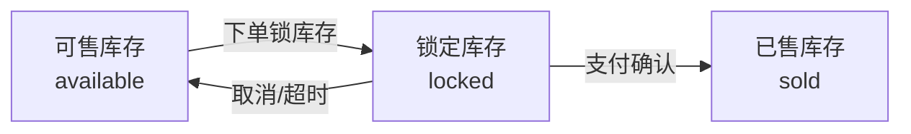

# 库存模型

## 三态分离设计

库存表 `inventory` 将商品库存分为三个独立字段：

| 字段 | 类型 | 含义 |
|------|------|------|
| `total_stock` | INT | 总库存，初始值 |
| `available_stock` | INT | 可售库存，用户可见的可购买数量 |
| `locked_stock` | INT | 锁定库存，已下单但未支付的库存 |
| `sold_stock` | INT | 已售库存，已支付确认的库存 |
| `version` | INT | 乐观锁版本号 |

### 关系约束

```
total_stock = available_stock + locked_stock + sold_stock
```

## 状态流转



## 操作流程

### 1. 下单锁库存

- **触发时机**：用户创建订单时，对每个商品明细调用 `lockStock()`
- **SQL 逻辑**：`UPDATE inventory SET available = available - N, locked = locked + N, version = version + 1 WHERE product_id = ? AND available >= N AND version = ?`
- **失败条件**：可售库存不足或版本号不匹配（乐观锁冲突）
- **同步操作**：将 `product.stock` 同步为 `available_stock` 新值

### 2. 支付确认

- **触发时机**：支付回调成功后，对每个商品明细调用 `confirmSoldStock()`
- **SQL 逻辑**：`UPDATE inventory SET locked = locked - N, sold = sold + N, version = version + 1 WHERE product_id = ? AND locked >= N AND version = ?`
- **注意**：`available_stock` 不变（下单时已扣减）

### 3. 取消释放

- **触发时机**：用户取消订单或订单超时自动取消
- **SQL 逻辑**：`UPDATE inventory SET available = available + N, locked = locked - N, version = version + 1 WHERE product_id = ? AND locked >= N AND version = ?`
- **同步操作**：将 `product.stock` 同步为 `available_stock` 新值

## 并发安全

### 乐观锁

每次库存变更都携带 `version` 字段：

1. 读取当前 `inventory` 记录（包含 `version`）
2. 执行 UPDATE 时 `WHERE version = ?`
3. 如果 `affected rows == 0`，说明被其他事务修改过，抛出库存不足异常

### 库存流水

每次库存变更都记录 `inventory_log`：

| 字段 | 说明 |
|------|------|
| `product_id` | 商品 ID |
| `order_id` | 关联订单 ID |
| `change_type` | 变动类型（`ORDER_LOCK`、`ORDER_RELEASE`、`PAYMENT_CONFIRM`、`ADMIN_ADJUST`、`INITIALIZE`） |
| `change_quantity` | 变动数量 |
| `before_available` | 变动前可售库存 |
| `after_available` | 变动后可售库存 |
| `remark` | 备注 |
