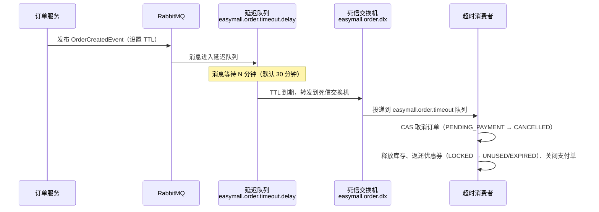

# MQ 事件驱动

## 领域事件模型

所有事件使用统一的 `DomainEvent<T>` 封装：

| 字段 | 类型 | 说明 |
|------|------|------|
| `messageId` | String | 事件唯一 ID（UUID） |
| `eventType` | String | 事件类型 |
| `aggregateType` | String | 聚合类型（`ORDER`、`PRODUCT`） |
| `aggregateId` | Long | 聚合根 ID |
| `occurredAt` | LocalDateTime | 事件发生时间 |
| `data` | T | 事件负载 |

## 事件定义

| 事件类型 | 负载 | 触发时机 | Exchange | Routing Key |
|---------|------|---------|----------|-------------|
| `OrderCreatedEvent` | `OrderCreatedPayload` | 下单成功 | `easymall.order` | `order.created` |
| `OrderCompletedEvent` | `OrderCompletedPayload` | 确认收货 | `easymall.order` | `order.completed` |
| `ProductChangedEvent` | `ProductChangedPayload` | 商品变更 | `easymall.product` | `product.changed` |

## 延迟关单流程

使用 RabbitMQ TTL + DLX（Dead Letter Exchange）实现订单超时自动取消：

### 队列拓扑

| 队列 | 用途 |
|------|------|
| `easymall.order.timeout.delay` | 延迟队列，消息过期后转发到 DLX |
| `easymall.order.timeout` | 超时消费队列，消费者处理取消逻辑 |
| `easymall.order.completed` | 订单完成消费队列，异步发放积分 |
| `easymall.product.changed` | 商品变更消费队列，清理 Redis 缓存 |

### Exchange 拓扑

| Exchange | 类型 | 说明 |
|----------|------|------|
| `easymall.order` | Topic | 订单事件交换机 |
| `easymall.product` | Topic | 商品事件交换机 |
| `easymall.order.dlx` | Direct | 订单超时死信交换机 |
| `easymall.consumer.dlx` | Direct | 消费者失败死信交换机 |

## 消费者幂等

### 消费日志

`message_consume_log` 表记录每条消息的消费状态：

- 消费前检查 `messageId` 是否已消费成功
- 已消费则直接 ACK，不重复处理

### ConsumeTemplate

`ConsumeTemplate` 封装了幂等消费模板：

1. 查询 `message_consume_log` 是否存在该 `messageId`
2. 已存在且成功 → 直接 ACK
3. 不存在 → 执行业务逻辑 → 记录消费日志 → ACK
4. 业务异常 → 记录失败日志 → NACK 重入队列

## 死信队列（DLQ）

消费失败超过重试次数的消息进入 DLQ：

| DLQ | 对应消费队列 |
|-----|------------|
| `easymall.order.timeout.dlq` | `easymall.order.timeout` |
| `easymall.order.completed.dlq` | `easymall.order.completed` |
| `easymall.product.changed.dlq` | `easymall.product.changed` |

## 缓存失效

商品变更事件 `ProductChangedEvent` 触发 Redis 缓存清理：

- 清除商品详情缓存
- 清除搜索结果缓存
- 清除热门/新品推荐缓存

## 事务安全

事件使用 `publishAfterCommit()` / `publishDelayedAfterCommit()` 在事务提交后投递，确保：
- 事务回滚时事件不会发送
- 消费者收到的消息对应的数据已持久化
