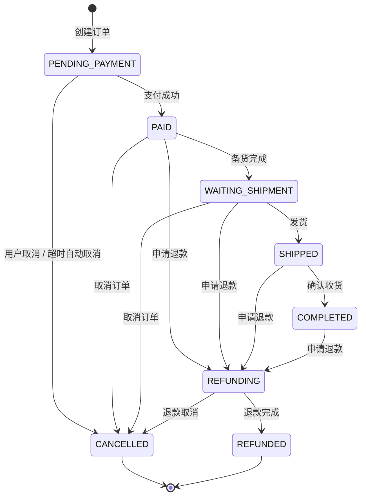

# 订单状态机

## 状态定义

| 状态码 | 枚举值 | 中文名 | 说明 |
|--------|--------|--------|------|
| 0 | `PENDING_PAYMENT` | 待支付 | 初始状态，下单后进入 |
| 1 | `PAID` | 已支付 | 用户完成支付 |
| 2 | `SHIPPED` | 已发货 | 管理员发货 |
| 3 | `COMPLETED` | 已完成 | 用户确认收货，触发 MQ 积分发放 |
| 4 | `CANCELLED` | 已取消 | 用户主动取消或超时自动取消 |
| 5 | `WAITING_SHIPMENT` | 待发货 | 管理员标记备货完成 |
| 6 | `REFUNDING` | 退款中 | 用户申请退款 |
| 7 | `REFUNDED` | 已退款 | 退款完成 |

## 状态转换表



## 合法转换规则

实现位于 `OrderStateMachine`，基于 `EnumMap<OrderStatus, Set<OrderStatus>>` 定义：

| 当前状态 | 允许转换到 |
|----------|-----------|
| `PENDING_PAYMENT` | `PAID`、`CANCELLED` |
| `PAID` | `WAITING_SHIPMENT`、`CANCELLED`、`REFUNDING` |
| `WAITING_SHIPMENT` | `SHIPPED`、`CANCELLED`、`REFUNDING` |
| `SHIPPED` | `COMPLETED`、`REFUNDING` |
| `COMPLETED` | `REFUNDING` |
| `REFUNDING` | `REFUNDED`、`CANCELLED` |
| `CANCELLED` | 无（终态） |
| `REFUNDED` | 无（终态） |

## 关键设计点

### 状态转换校验

所有状态流转通过 `OrderStateMachine.transit()` 统一处理：

1. 查询当前状态码对应的枚举值
2. 检查是否为目标状态（不允许相同状态转换）
3. 在 `TRANSITIONS` 表中查找允许的目标状态集合
4. 不在允许集合中的转换抛出 `BusinessException`

### 超时取消的并发安全

`cancelOrderByTimeout()` 使用 CAS 原子更新：

```java
int rows = orderMapper.casUpdateStatus(orderId,
    OrderStatus.PENDING_PAYMENT.getCode(),
    OrderStatus.CANCELLED.getCode());
```

只有当前状态仍为 `PENDING_PAYMENT` 时才能成功取消，防止与支付回调竞争。

### 确认收货触发异步积分

`confirmOrder()` 在订单状态转为 `COMPLETED` 后，发布 `OrderCompletedEvent` 到 RabbitMQ，由 `OrderCompletedPointsConsumer` 异步发放积分。
