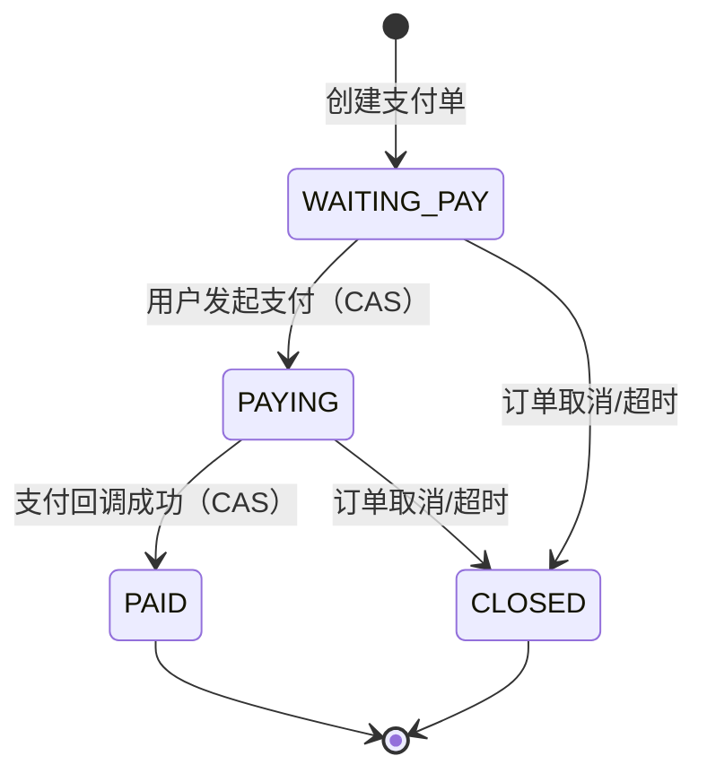

# 支付系统

## 支付单模型

支付单 `payment_order` 与订单一对一关联，记录每笔支付的完整生命周期。

### 字段说明

| 字段 | 说明 |
|------|------|
| `payment_no` | 支付单号（全局唯一，`PAY` + 雪花 ID） |
| `order_id` | 关联订单 ID |
| `order_no` | 关联订单号 |
| `user_id` | 用户 ID |
| `amount` | 支付金额 |
| `channel` | 支付渠道（当前为 `MOCK`） |
| `status` | 支付状态 |
| `third_trade_no` | 第三方交易号 |
| `paid_time` | 支付完成时间 |

## 支付状态生命周期



| 状态 | 代码 | 说明 |
|------|------|------|
| `WAITING_PAY` | 待支付 | 初始状态 |
| `PAYING` | 支付中 | 用户发起支付后，CAS 更新 |
| `PAID` | 已支付 | 支付回调确认 |
| `CLOSED` | 已关闭 | 订单取消时关闭 |
| `FAILED` | 支付失败 | 支付异常 |

## 支付幂等机制

### 1. 创建支付单幂等

下单时检查是否已有活跃支付单（状态为 `WAITING_PAY` 或 `PAYING`），避免重复创建。

### 2. 发起支付 CAS

```java
// CAS: WAITING_PAY → PAYING，并发请求被拒绝
int updated = paymentOrderMapper.update(null,
    new LambdaUpdateWrapper<PaymentOrder>()
        .eq(PaymentOrder::getPaymentNo, paymentNo)
        .eq(PaymentOrder::getStatus, PaymentStatus.WAITING_PAY.getCode())
        .set(PaymentOrder::getStatus, PaymentStatus.PAYING.getCode()));
```

CAS 失败后重新查询状态：
- 如果已为 `PAID`，返回"已支付"
- 其他状态，返回"状态不允许此操作"

### 3. 回调处理幂等

`processCallback()` 流程：

1. **记录回调日志** — 独立事务保存原始回调数据（降级：失败不阻塞主流程）
2. **幂等校验** — 已为 `PAID` 状态直接返回成功
3. **状态校验** — 仅 `PAYING` 状态可处理
4. **金额校验** — 回调金额与支付单金额必须一致
5. **CAS 更新支付单** — `PAYING → PAID`
6. **CAS 更新订单** — `PENDING_PAYMENT → PAID`，防止与超时取消竞争
7. **确认库存** — `locked_stock → sold_stock`
8. **确认优惠券** — `LOCKED → USED`

### 4. 支付与超时取消的竞争

- 超时取消使用 `casUpdateStatus(orderId, PENDING_PAYMENT, CANCELLED)`
- 支付回调使用 `casUpdateStatus(orderId, PENDING_PAYMENT, PAID)`
- 两者互斥：只有一个能成功，另一个发现状态已变更后安全退出

## 回调日志

`payment_callback_log` 记录每次支付回调：

| 字段 | 说明 |
|------|------|
| `payment_no` | 支付单号 |
| `channel` | 支付渠道 |
| `callback_raw` | 回调原始 JSON 数据 |
| `result` | 处理结果（`RECEIVED`、`SUCCESS`、`IDEMPOTENT_SUCCESS`、`STATUS_INVALID`、`AMOUNT_MISMATCH`、`PAYMENT_NOT_FOUND`） |
