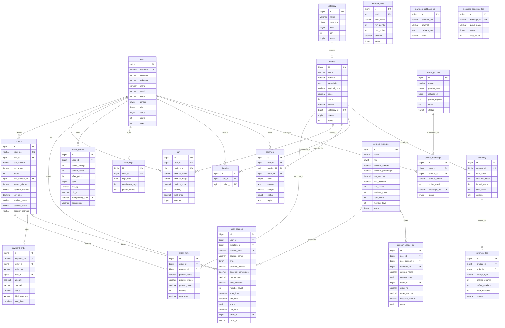

# 数据库设计

## ER 关系图



## 核心表说明

### 用户与会员

| 表名 | 说明 |
|------|------|
| `user` | 用户基础信息、积分、等级、角色 |
| `member_level` | 会员等级配置（5 级：普通 → 钻石） |
| `user_sign` | 签到记录，`uk_user_date` 唯一约束防止重复签到 |

### 商品与分类

| 表名 | 说明 |
|------|------|
| `product` | 商品信息，`stock` 字段与 `inventory.available_stock` 同步 |
| `category` | 商品分类，支持多级（`parent_id`） |

### 订单与支付

| 表名 | 说明 |
|------|------|
| `orders` | 订单主表，含会员折扣、优惠券金额、收货信息 |
| `order_item` | 订单明细，记录每个商品的购买数量和价格 |
| `payment_order` | 支付单，`uk_payment_no` 唯一，记录支付状态和第三方交易号 |
| `payment_callback_log` | 支付回调日志，记录每次回调的原始数据和处理结果 |

### 库存

| 表名 | 说明 |
|------|------|
| `inventory` | 库存主表，三态分离（`available`/`locked`/`sold`），乐观锁 `version` |
| `inventory_log` | 库存变动流水，记录每次操作的前后状态 |

### 优惠券

| 表名 | 说明 |
|------|------|
| `coupon_template` | 优惠券模板，定义优惠规则和发放数量 |
| `user_coupon` | 用户持有的优惠券，6 种状态生命周期 |
| `coupon_usage_log` | 使用/返还记录 |

### 积分

| 表名 | 说明 |
|------|------|
| `points_record` | 积分流水，`biz_type + biz_id` 唯一约束实现幂等 |
| `points_product` | 积分兑换商品，支持实物和优惠券两种类型 |
| `points_exchange` | 积分兑换记录 |

### 消息消费

| 表名 | 说明 |
|------|------|
| `message_consume_log` | MQ 消息消费日志，`message_id` 唯一约束实现消费幂等 |

## Flyway 迁移策略

### 迁移脚本管理

- 脚本位于 `easymall-backend/src/main/resources/db/migration/`
- 命名格式：`V{N}__{description}.sql`
- Flyway 在应用启动时自动执行未应用的迁移

### 迁移版本说明

| 版本 | 说明 |
|------|------|
| V1 | 核心表创建：`user`、`category`、`product`、`orders`、`order_item`、`cart`、`comment`、`favorite` |
| V2 | 会员系统：`member_level`、`points_record`、`user_sign` |
| V3 | 积分兑换：`points_product`、`points_exchange` |
| V5 | 优惠券系统：`coupon_template`、`user_coupon`、`coupon_usage_log`；订单添加优惠券字段 |
| V6 | 库存系统：`inventory`、`inventory_log`；从 `product.stock` 初始化 `inventory` 数据 |
| V7 | 支付系统：`payment_order`、`payment_callback_log` |
| V8 | 消息消费日志：`message_consume_log` |
| V9 | 积分幂等：`points_record` 添加 `idempotency_key` 唯一约束 |
| V10 | 优惠券生命周期索引优化 |
| V11 | 积分业务标识：`points_record` 添加 `biz_type`、`biz_id` 列及唯一索引 |

### 生产环境配置

```yaml
spring:
  flyway:
    enabled: true
    baseline-on-migrate: true   # 首次部署时自动创建基线
```

- `baseline-on-migrate: true` 允许在已有数据库上首次执行 Flyway
- 所有迁移脚本使用 `IF NOT EXISTS` 和 `ON DUPLICATE KEY UPDATE`，支持重复执行
